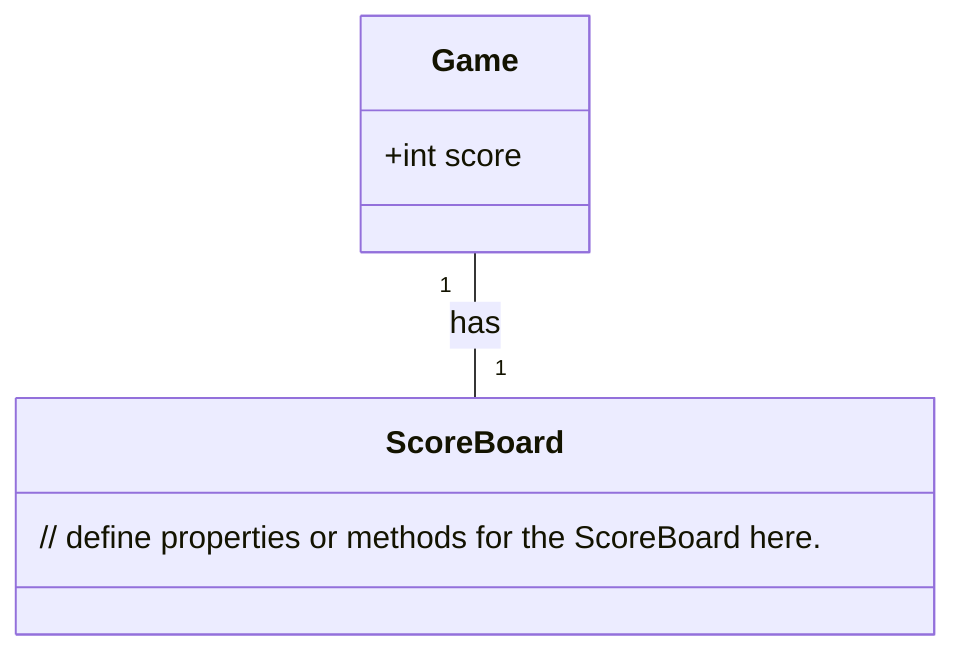
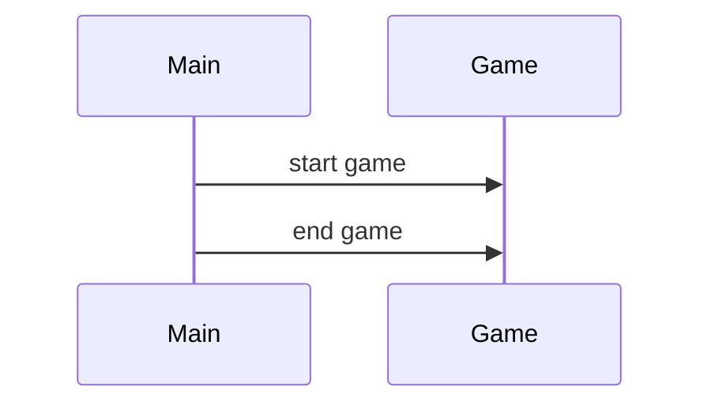

# Context
{context}

## Format example
{format_example}
-----
Role: You are an architect; the goal is to design a SOTA PEP8-compliant python system; make the best use of good open source tools
Requirement: Fill in the following missing information based on the context, note that all sections are response with code form separately
Max Output: 8192 chars or 2048 tokens. Try to use them up.
Attention: Use '##' to split sections, not '#', and '## <SECTION_NAME>' SHOULD WRITE BEFORE the code and triple quote.

## Implementation approach: Provide as Plain text. Analyze the difficult points of the requirements, select the appropriate open-source framework.
 
## Swift package name: Provide as Python str with python triple quoto, concise and clear, characters only use a combination of all lowercase and underscores

## File list: Provided as Python list[str], the list of ONLY REQUIRED files needed to write the program(LESS IS MORE!). Only need relative paths, comply with PEP8 standards. ALWAYS write a main.py or app.py here

## Data structures and interface definitions: Use mermaid classDiagram code syntax, including classes (INCLUDING __init__ method) and functions (with type annotations), CLEARLY MARK the RELATIONSHIPS between classes, and comply with PEP8 standards. The data structures SHOULD BE VERY DETAILED and the API should be comprehensive with a complete design. 

## Program call flow: Use sequenceDiagram code syntax, COMPLETE and VERY DETAILED, using CLASSES AND API DEFINED ABOVE accurately, covering the CRUD AND INIT of each object, SYNTAX MUST BE CORRECT.

## Anything UNCLEAR: Provide as Plain text. Make clear here.

"""
FORMAT_EXAMPLE = """
---
## Implementation approach
We will ...

## Swift package name
```python
"snake_game"
```

## File list
```python
[
    "main.py",
]
```

## Data structures and interface definitions


## Program call flow


## Anything UNCLEAR
The requirement is clear to me.
---