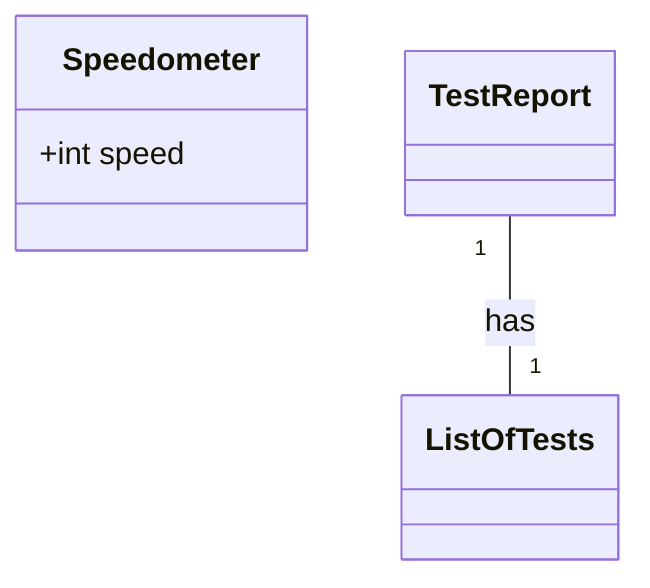
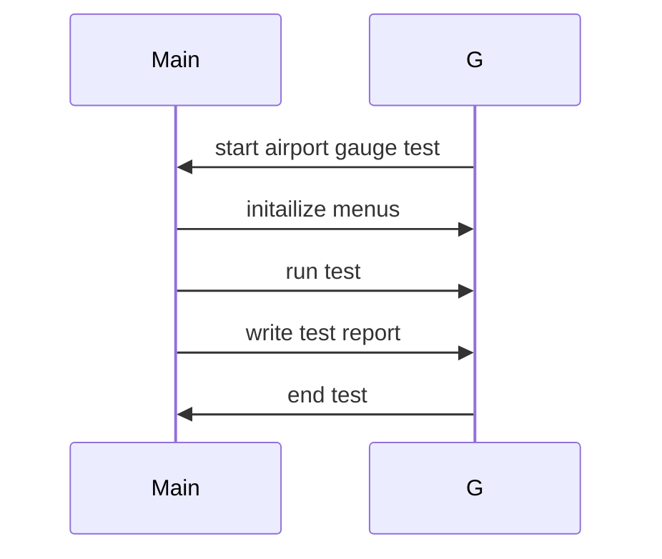

## Implementation approach
- We are going to use the following sutable open source tools ...
- The challenges posed by the requirements are ...

## Swift package name
```python
"airport_gauge_test"
```

## File list
```swift
[
    "main.swift",
]
```

## Data structures and interface definitions


## Program call flow
