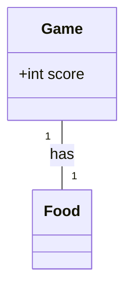
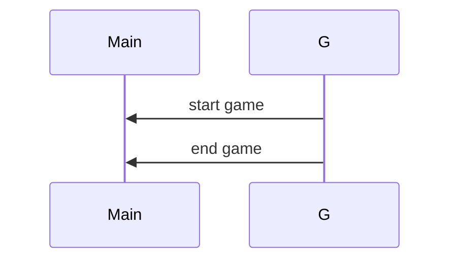

## Implementation approach
We will ...

## Swift package name
```python
"airport_gauge_test"
```

## File list
```swift
[
    "main.swift",
]
```

## Data structures and interface definitions


## Program call flow
